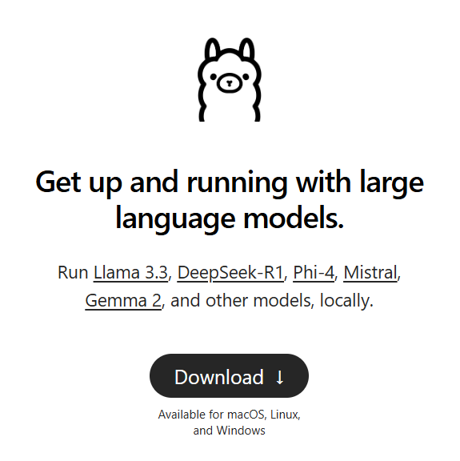
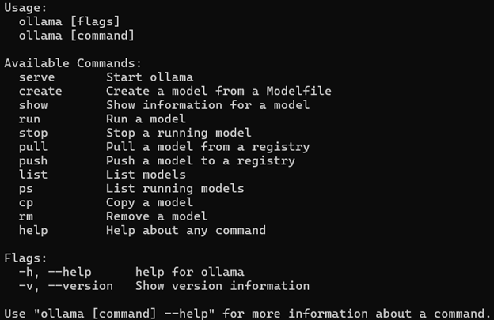
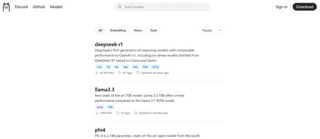

# Ollama

## Resumen de Ollama

Ollama es un programa que nos permite descargar modelos de inteligencia artificial, con la posibilidad de correr estos modelos de manera local.
Pero, ¿por que buscariamos correr un modelo de manera local?.
Aunque las respuestas pueden depender de la persona y/o el contexto, por lo regular se corren los modelos de esta manera para buscar una mayor privacidad, ya que al correr los modelos de manera local, la informacion se quedan en la computadora. Ademas de que se puede conectar con bibliotecas (como langchain), que nos permitan utilizar el modelo añadiendole nuevas y diferentes funcionalidades.
Es necesario tener en cuenta que los modelos no podran acceder a internet debido a que se corren de manera local (a menos de que se convinen con herramientas como langchain), sin mencionar que la rapidez o la capacidad del modelo en nuestra maquina, depende de los componentes que tenga la misma, en este sentido, correr un modelo grande en una maquina de recursos basicos, no es la mejor opcion.

---

## Instalacion 

### Descargar Ollama

La instalacion de los modelos es bastante sencillo, basta con visitar la [pagina oficial del programa](https://ollama.com/) y seleccionar el boton el descarga, el cual descargara un archivo ejecutable y comenzara la instalacion.

### Instalar modelos

Una vez instalado Ollama, podemos observar los comandos del programa unicamente colocando `ollama` y nos mostrara lo siguiente:

A partir de aqui, tenemos dos opciones para instalar los modelos:

- Descargando unicamente el modelo
    - `ollama pull llama3`

- Descargando y corriendo el modelo
    - `ollama run llama3`

Para que modelos podemos descargar podemos acceder a la pagina official de Ollama y explorar los diversos modelos que la pagina nos ofrece.

[Accede desde aqui c:](https://ollama.com/search)

---

## ¿Mas informacion?

- [Blocs](https://ollama.com/blog)
- [GitHub](https://github.com/ollama/ollama)
- [Documentacion](https://github.com/ollama/ollama/tree/main/docs)